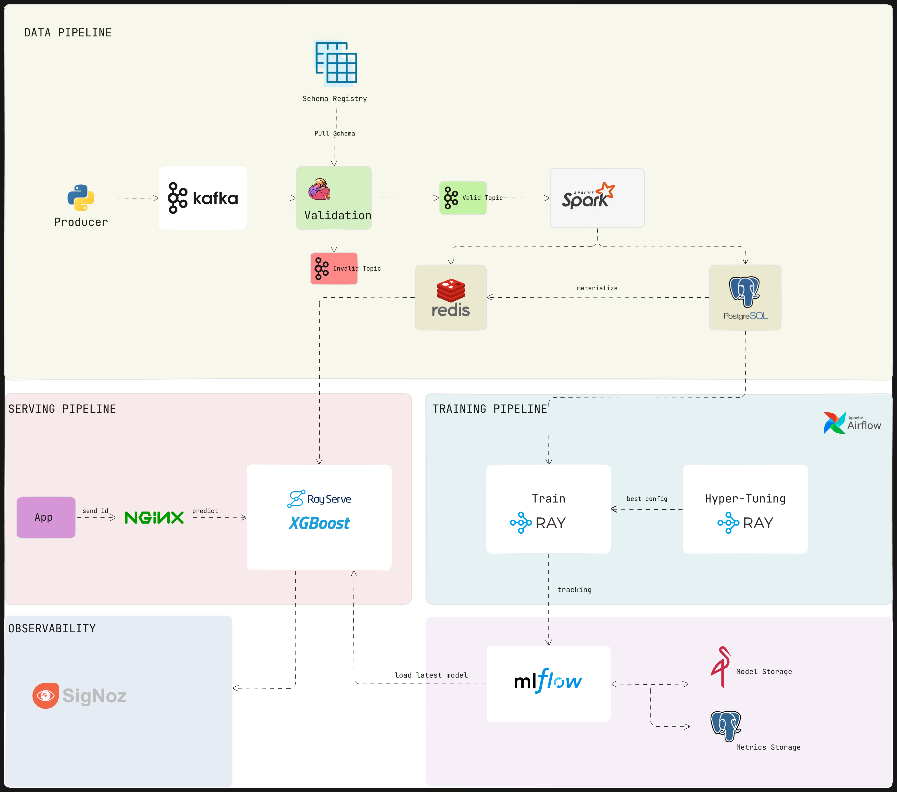

# 🔗 Real-Time ML System Pipeline

This project demonstrates a production-grade, end-to-end machine learning system pipeline that supports **real-time data ingestion**, **feature validation**, **feature engineering**, **model training**, **feature serving**, and **observability** — all built with scalable and modular components.

## 📌 Overview

The pipeline is composed of the following components:

- **Data Ingestion & Validation**: Ingests raw events from producers and validates them against schemas.
- **Feature Engineering**: Transforms raw data into features using Spark Streaming.
- **Feature Store**: Manages real-time and batch feature data using Redis and PostgreSQL.
- **Model Training**: Performs distributed training and hyperparameter tuning using Ray.
- **Model Registry**: Tracks and manages model versions using MLflow.
- **Model Serving**: Provides low-latency predictions via Ray Serve behind an NGINX gateway.
- **Observability**: Monitors metrics and logs using OpenTelemetry and SigNoz.
- **Data Warehouse**: Stores transformed analytical data for visualization and long-term analysis.

---

## 🗂 Architecture Components

### 1. **Data Pipeline**
- **Producers**: Send raw event logs to Kafka.
- **Schema Registry**: Ensures data format consistency.
- **Validation Service**: Validates events; routes invalid data to Elasticsearch for alerting.
- **Spark Streaming**: Pushes validated events to the Online and Offline Feature Stores.

### 2. **Feature Store**
- **Online Store**: Low-latency store (Redis) for serving.
- **Offline Store**: Batch store (PostgreSQL) used for training and analytics.

### 3. **Training Pipeline**
- **Ray Train & Tune**: Performs distributed training and hyperparameter tuning.
- **Airflow**: Orchestrates batch training and feature materialization.
- **MLflow**: Manages experiment tracking and model versioning.

### 4. **Model Serving**
- **Ray Serve**: Deploys XGBoost models for inference.
- **NGINX**: Routes prediction requests from client apps to Ray Serve.

---

## 📦 Getting Started
